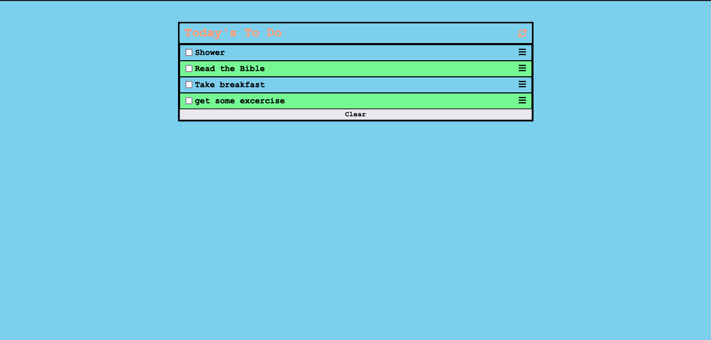

# TO DO LIST

> A simple app that will help a User manage their daily tasks smoothly.



- A User can add a Task.
- A User cam mark a Task as completed by clicking a checkbox associated with that task.
- A User can clear all finished tasks by clicking the ```clear``` button at the bottom of the list.

## Built With

- Javascript, HTML and CSS
- Webpack

## Live Demo

[Live Demo Link](https://emmyobonyo.github.io/ToDoApp/)


## Getting Started

- In terminal, navigate to the directory on your computer where you'd like to store the files and then type this commmand ```git clone https://github.com/emmyobonyo/ToDoApp.git``` and wait for the files to clone.
- Download ```npm``` and ```node modules``` to the root directory of the folder.
- Run ```npm start``` in the root directory of your folder.
- Enjoy awesomeness.

## Authors

👤 **Emmanuel Obonyo**

- GitHub: [@githubhandle](https://github.com/emmyobonyo)
- Twitter: [@twitterhandle](https://twitter.com/emmyobonyo)
- LinkedIn: [LinkedIn](https://www.linkedin.com/in/emmanuel-obonyo-3728a2200/)

## 🤝 Contributing

Contributions, issues, and feature requests are welcome!

## Show your support

Give a ⭐️ if you like this project!

## Acknowledgments

- Hat Tip to [Microverse](https://www.microverse.org/) for the linters.

## 📝 License

This project is [MIT](./MIT.md) licensed.
